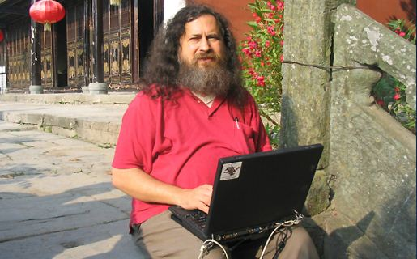

# ¿Qué es el software libre?

El software libre es aquel software publicado bajo una licencia libre como [GPL](https://www.gnu.org/licenses/license-list.html#GNUGPLv3), [BSD](https://www.gnu.org/licenses/license-list.html#ModifiedBSD) o similar ([lista de licencias OSI approved](https://opensource.org/licenses/alphabetical)) y que cumple los denominados requisitos del software libre, los cuales pueden resumirse en:

* La libertad de ejecutar el programa como se desee, con cualquier propósito (libertad 0).
* La libertad de estudiar cómo funciona el programa, y cambiarlo para que haga lo que usted quiera (libertad 1).  El  acceso al código fuente es una condición necesaria para ello.
* La libertad de redistribuir copias para ayudar a otros (libertad 2).
* La libertad de distribuir copias de sus versiones modificadas a terceros (libertad 3). Esto le permite ofrecer  a   toda la comunidad la oportunidad de beneficiarse de las modificaciones. El acceso al código fuente es una  condición necesaria para ello.

## ¿Quién es Richard Stallman?

Richard Matthew Stallman (nacido en Manhattan, Nueva York, 16 de marzo de 1953), con frecuencia abreviado como «rms»,​ es un programador estadounidense y fundador del movimiento por el software libre en el mundo.

Entre sus logros destacados como programador se incluye la realización del editor de texto GNU Emacs, el compilador GCC,​ y el depurador GDB,​ bajo la rúbrica del Proyecto GNU. Sin embargo, es principalmente conocido por el establecimiento de un marco de referencia moral, político y legal para el software libre, un modelo de desarrollo y distribución alternativo al software privativo. Es también inventor del concepto de copyleft (aunque no del término), un método para licenciar software de tal forma que su uso y modificación permanezcan siempre libres y queden en la comunidad de usuarios y desarrolladores.
